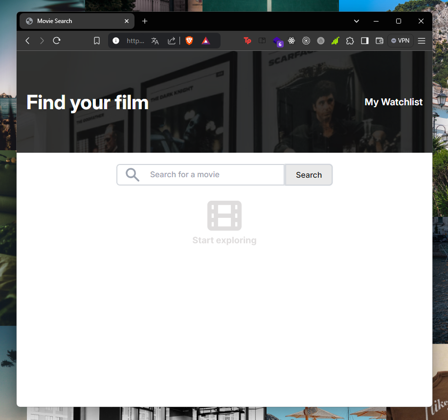
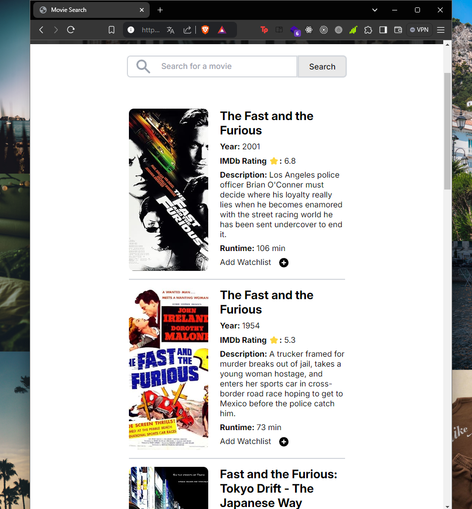
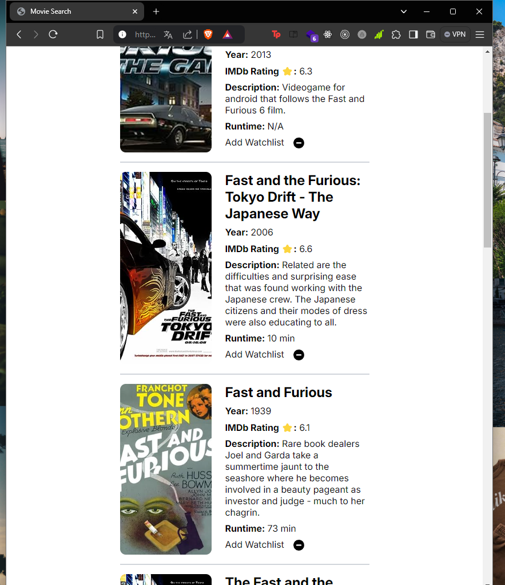
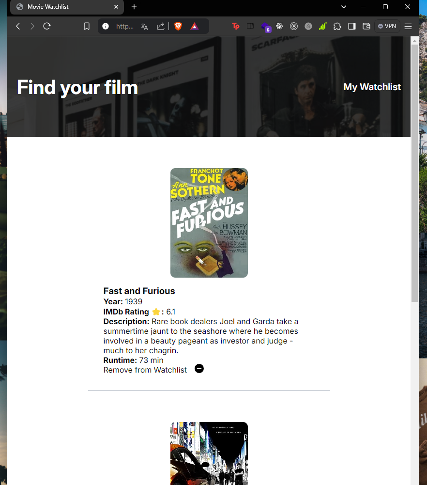

# Movie Watchlist App

This project is a responsive Movie Watchlist web application that allows users to search for movies using the OMDB API, add them to a watchlist, and view the watchlist on a separate page. The app is created as part of a learning exercise.

## Screenshots

### SS1


### SS2


### SS3


### SS4



## Features

- **Responsive Design**: The app is designed to work seamlessly across different devices, ensuring an optimal user experience on mobile, tablet, and desktop screens.
- **Movie Search**: Users can search for movies using the OMDB API and see results with relevant details such as title, year, IMDb rating, description, and runtime.
- **Watchlist Management**: Users can add movies to a watchlist, which is stored locally on the user's device. The watchlist can be viewed and managed from a separate page.
- **Interactive UI**: The interface is designed with user interaction in mind, allowing users to easily navigate between the search page and the watchlist.

## Technologies Used

- HTML
- CSS (including media queries for responsiveness)
- JavaScript (including localStorage for watchlist persistence)
- OMDB API

## Structure

### HTML

The HTML files include the following main sections:

1. **Header**: A header section with a site title and links to the watchlist and search pages.
2. **Search Section**: An input field and button for searching movies, with results displayed below.
3. **Main Content**: Dynamic content that displays movie details based on user search or watchlist.
4. **Footer**: (Optional) A footer can be added for additional site navigation or information.

### CSS

The CSS file includes styles for:

- **Typography**: Custom fonts and text styles, using the Google Fonts library.
- **Layout**: A responsive layout for movie details and watchlist items, utilizing flexbox and media queries for adaptability across devices.
- **Responsive Design**: Media queries that adjust the layout and styling based on the screen size, ensuring the site looks great on all devices.

## Setup and Usage

1. **Clone the repository**:
    ```sh
    git clone https://github.com/lambersonistaken/movie-watchlist.git
    ```

2. **Navigate to the project directory**:
    ```sh
    cd movie-watchlist
    ```

3. **Open `index.html` in your web browser** to start using the app.

## License

This project is licensed under the MIT License. See the [LICENSE](./LICENSE) file for more information.

## Acknowledgements

- This project was developed as part of a personal learning exercise.
- Movie data is fetched from the [OMDB API](http://www.omdbapi.com/).
- Background image from Unsplash.

---

You can customize the repository link, license, or any other sections as needed. If you want to add a video below the screenshots section, you can include the following:

### Video Demo

